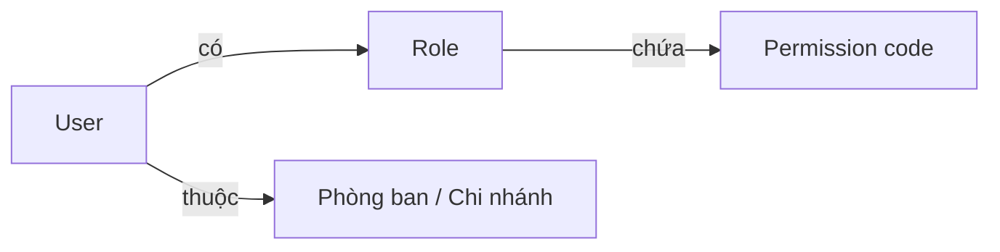
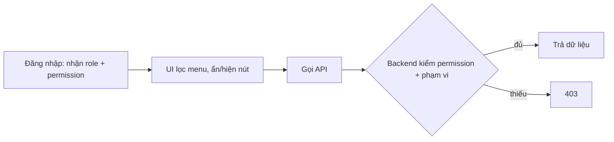
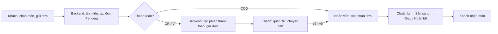

# Authentication, Authorization và quy trình đặt hàng – Bánh Cuốn Tây Hồ 127

Ghi chú ngắn để tra cứu lại. Có thể tải file này lên NotebookLM làm nguồn.

## 1. Cốt lõi (3 dòng)

- **Authentication (xác thực)** = bạn là ai. Sai → 401.
- **Authorization (phân quyền)** = bạn được làm gì. Thiếu quyền → 403.
- Phân quyền gồm 2 câu hỏi tách biệt: **được làm gì** (Role → Permission) và **trên dữ liệu nào** (Phòng ban / Chi nhánh).

## 2. Mô hình

- Role + Permission = ĐƯỢC LÀM GÌ (ví dụ `users.view`, `orders.manage`).
- Phòng ban / Chi nhánh = TRÊN DỮ LIỆU NÀO. Không tự cấp quyền.

## 3. Flow mỗi lần thao tác

Quy tắc: UI chỉ ẩn/hiện cho đẹp. **Backend mới chặn thật.**

## 4. Trong project này

- Admin: BFF `app/api/admin/auth/*`, token nằm trong cookie HttpOnly. Browser không thấy token.
- UI: `useAdminAuth().hasPermission(code)`; menu sidebar do Backend trả đã lọc theo quyền (`GET /navigation/menus`).
- Khách (Site) tách riêng với Admin, không gộp (`features/auth` và `features/admin-auth`).
- Gán phạm vi: `features/organization` (user ↔ phòng ban / chi nhánh).

## 5. Quy trình đặt hàng (BPMN rút gọn)

- Trạng thái đơn: `Pending → Confirmed → Preparing → Ready → Delivering → Completed` (hoặc `Cancelled`). Đơn lấy tại quán bỏ bước `Delivering`.
- Khách không tự đánh dấu "đã trả". Nhân viên xác nhận tiền ở Admin, trang thanh toán tự kiểm tra rồi chuyển hướng.
- Chưa vẽ: hủy đơn, phiên thanh toán hết hạn/thất bại, hoàn tiền.

## 6. Nguồn tham khảo (đã tìm, chưa đọc kỹ từng bài)

- NIST – Role-Based Access Control: https://csrc.nist.gov/projects/role-based-access-control
- NIST – RBAC 2010 (PDF): https://www.nist.gov/system/files/documents/2018/06/27/no_10_role-based_access_control_2010.pdf
- Authentication vs Authorization (Azion): https://www.azion.com/en/learning/websec/what-is-authentication-and-authorization/
- Authentication vs Authorization (Cerbos): https://www.cerbos.dev/blog/authentication-vs-authorization.md
- ASP.NET Core – claims, roles, policies: https://www.luisllamas.es/en/aspnet-core-claims-roles-authorization-policies/
- Policy-based authorization in ASP.NET Core: https://codewithmukesh.com/blog/policy-based-authorization-in-aspnet-core/
- OWASP Top 10 – A01 Broken Access Control (tìm trực tiếp trên owasp.org để lấy bản chính thức)

## 7. Từ khóa để tìm lại

`authentication`, `authorization`, `RBAC`, `permission code`, `scope phòng ban / chi nhánh`, `401 vs 403`, `BFF cookie HttpOnly`, `policy-based authorization`.
